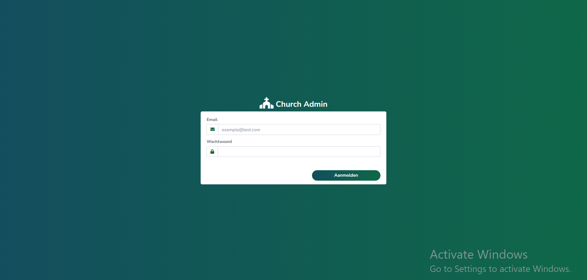
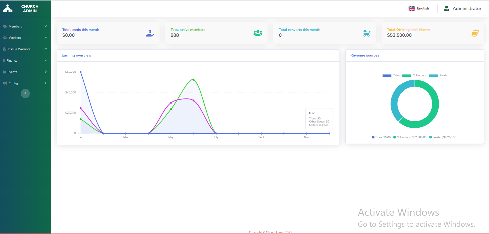
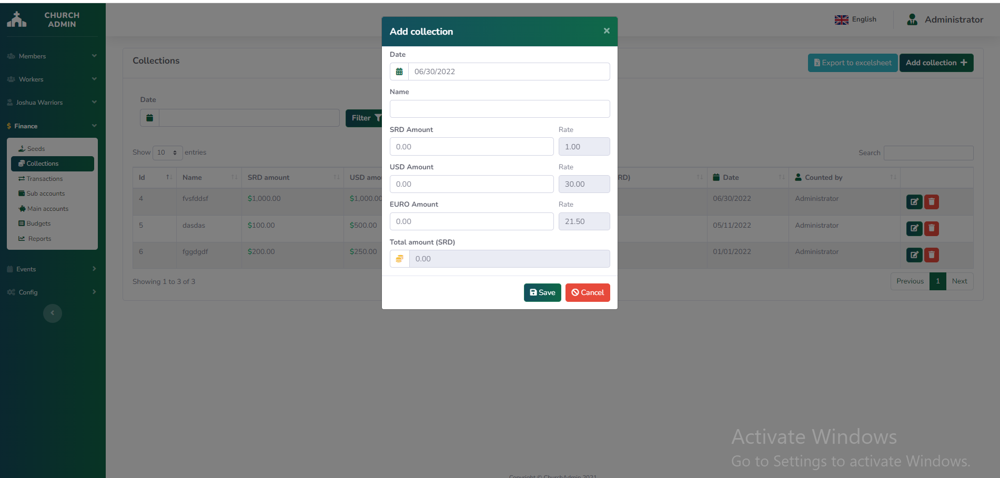

# 📘 Church Management System

A web-based church management application built with Laravel 8 and MySQL, designed to help administrators efficiently manage members, finances, and church activities.

---

## ✨ Overview

This system provides a centralized platform for managing church operations, including member records, financial transactions (tithes and offerings), and reporting. It is built with usability and data organization in mind, enabling administrators to streamline daily tasks and maintain accurate records.

---

## 🚀 Features

- **Member Management**
  - Full CRUD (Create, Read, Update, Delete) for members
  - Support for managing member relationships (families, dependents, etc.)

- **Financial Management**
  - Track tithes, offerings, and other transactions
  - Bank account management for financial records

- **Document Management**
  - Secure file uploads for sensitive member documents

- **Reports & Analytics**
  - Detailed financial reports
  - Insights into member activity and movement

---

## 🛠️ Tech Stack

The application is built using the following technologies:

- **Backend**
  - Laravel 8

- **Database**
  - MySQL

- **Frontend & UI**
  - AdminLTE
  - Bootstrap 4.6

- **Plugins & Libraries**
  - FullCalendar

---

## 📸 Screenshots

Screenshots showcasing the application interface and features can be found below:

### Login



### Dashboard



### Transaction



### List


---

## 📦 Getting Started

### Prerequisites

- PHP >= 7.4
- Composer
- MySQL
- Node.js & NPM (for frontend assets)

### Installation

```bash
git clone https://github.com/NigellRudge/ChurchManagement.git
cd churchManagement

composer install
cp .env.example .env
php artisan key:generate
```

### Configure Environment

Update your `.env` file with your database credentials.

```bash
php artisan migrate
php artisan serve
```
